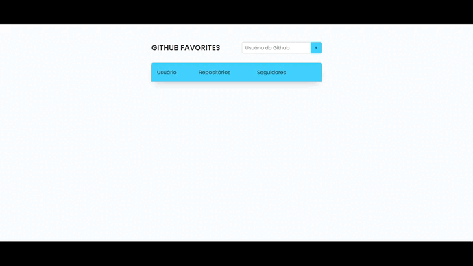

<h1 align="center">
  Favorites Github
</h1>

<h2 align="center" >Descrição do Projeto</h2>
<p align="center">
   Sabe aquela vontade de ter todos os seus perfils favoritos do GitHub salvo em uma lista, então nunca mais passará essa voltade. O Favorites Github faz todo esse trabalhado para você, basta apenas digitar o nome do usuario e pronto, em poucos passos o perfil é adicionado em sua lista de perfis favoritos do GitHub.
</p>

<h1 align="center">
  
</h1>

## 🔎 Features

- [x] Buscar por perfil na API do GitHub.
- [x] Adicionar perfil na lista (via localStorage).
- [x] Excluir perfil da lista (via localStorage).
- [x] Validação para não adicionar um mesmo perfil duas vezes a lista

## :rocket: Tecnologias

Esse projeto foi desenvolvido com as seguintes tecnologias:

✔️ JavaScript

✔️ HTML

✔️ CSS

✔️ ES6 Modules

✔️ Api

✔️ localStorage

<h2>Pré-requisitos</h2>

Antes de começar, você vai precisar ter instalado em sua máquina as seguintes ferramentas:
[Git](https://git-scm.com) e [Node](https://nodejs.org/pt-br/).
Além disto é bom ter um editor para trabalhar com o código como [VSCode](https://code.visualstudio.com/).
 https://github.com/gabriel-assana/Favorites-Github

## 🔗 Link da aplicação no ar: https://favorites-github.netlify.app/

# 👨‍💻 Rodando o Front End

```bash
# Clone este repositório
$ git clone https://github.com/gabriel-assana/Favorites-Github
# Acesse a pasta do projeto no terminal/cmd
$ cd Favorites-Github
# Abra um novo terminal e execute a aplicação em modo de desenvolvimento
$ yarn start
# O servidor do front-end inciará na porta:http://localhost:3000/ - acesse <http://localhost:3000/>
